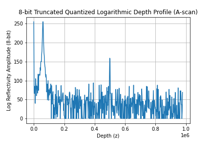

# Dynamic range compression

## Overview
To understand the purpose and implications of the logarithmic display scale in OCT, we will walk through the key OCT processing steps—from acquisition to visualization—using a simple 1D simulated example.

The simulation includes the following steps:
1. **Generating a raw OCT signal** in the wavenumber domain from a sample with two reflective surfaces.
2. **Applying FFT** to extract the depth profile.
3. **Using a logarithmic transformation** for dynamic range compression.
4. **8-bit quantization** to enable visualization.

## Terminology
- **A-scan**: Refers to a 1-dimensional OCT depth profile.
- **Bit Depth**: Indicates the number of bits used to represent the information of each sample in the OCT data. A bit depth of 8 bits corresponds to 256 possible values.
- **Dynamic Range**: Refers to the difference between the strongest and weakest simultaneously displayable signals in an A-scan.

## Key facts
Standard displays can show 256 brightness levels (8-bit) for each color. Images with higher bit depth must be converted to 8-bit for proper display.

## 1. OCT Signal Generation in Wavenumber Domain
Here, we model a raw OCT signal acquired by an 8-bit analog-to-digital converter, meaning the signal values are restricted to the range of 0 to 255.

The OCT signal is modeled as a sum of two cosine functions with added random noise. These cosine functions represent two layers of a sample, each with different reflectivities at different depths. The signal is generated as:

$$ s(k) = A_1 \cdot \cos(2\pi \cdot d_1 \cdot k) + A_2 \cdot \cos(2\pi \cdot d_2 \cdot k) + \text{noise}(k) $$

Where:
- **A_1 = 80** reflectivity of first layer
- **d_1 = 60000** position of first layer
- **A_2 = 8** reflectivity of second layer
- **d_2 = 500000** position of second layer
- **noise(k)**  random noise function.
- **k** wavenumber

The raw signal in the wavenumber domain is plotted below:

## 2. FFT to Generate Depth Profile

To convert the OCT signal from the wavenumber domain to the depth domain, we apply the **Fast Fourier Transform (FFT)**. The depth profile (A-scan) is computed by taking the absolute value of the FFT output:

$$ \text{Depth Profile} = \left| \text{FFT}(s(k)) \right| $$

The resulting depth profile is shown below:

Note that the height of the two peaks is __not quite__ equal to the reflectivity values set during the modeling of the raw signal. Due to the added noise, the amplitudes vary slightly, causing the peaks to differ slightly from the exact reflectivity values. Without the noise, the peak heights would match the reflectivity values exactly.

## 3. Logarithmic Depth Profile

The second, weaker surface reflection is barely visible! To enhance its visibility while still showing the strong first peak, a logarithmic scale can be used:

$$ \text{Log Reflectivity} = 20 \cdot \log_{10}(\text{Depth Profile}) $$

The logarithmic depth profile is plotted below:

## 4. 8-bit Quantized Depth Profile

To obtain meaningful values from the logarithmic calculation, 32-bit floating-point precision is used, enabling the representation of both negative and fractional values resulting from the transformation.

However, for visualization, we need to **quantize the signal to 8-bit**, a process often referred to as **grayscale conversion**. This involves scaling the logarithmic depth profile to fit within the range \([0, 255]\), and rounding the values to integers:

$$ \text{Quantized Log Reflectivity} = \left( \frac{\text{Log Reflectivity} - \min}{\max - \min} \right) \cdot 255 $$

Where:
- **min** is the minimum value of the depth profile.
- **max** is the maximum value of the depth profile.

The result is the following 8-bit quantized depth profile:

## 5. Truncated 8-bit Quantized Depth Profile

Now, after the 8-bit quantization, the depth profile can be properly displayed, but nearly one-third of the reflectivity range is wasted on noise!

To improve image contrast, we truncate the signal by adjusting the values for min and max in the 8-bit quantization. We select these values in such a way that unwanted parts, like noise, are cut off. This stretches the relevant portion of the signal, allowing it to use the full 8-bit range.

In practice, it may not be easy to set the right values for min and max, as you usually don't know in advance which value range contains the most relevant information. Only after collecting a series of measurements from similar samples can you get a sense of what values for min and max to use. However, if the type of sample changes, you'll likely need to readjust these values.

The truncated and quantized depth profile is shown below:

## 2D Images
The concepts discussed above apply equally in 2D:

## Conclusion
To visualize both strong and weak reflections within the same depth profile, a logarithmic scale is used to compress the dynamic range. Grayscale conversion is then applied to display the log-transformed data on 8-bit screens. Min-Max Scaling can improve image contrast by removing noise and making the important areas use the full 8-bit range. However, what is considered noise or important depends on the specific application, so the Min-Max scaling must be adjusted accordingly.

## Code
The code used to generate the plots above can be found here:
- [dynamic_range_compression.py](../code/dynamic_range_compression.py)
- [dynamic_range_compression_2d.py](../code/dynamic_range_compression_2d.py)

